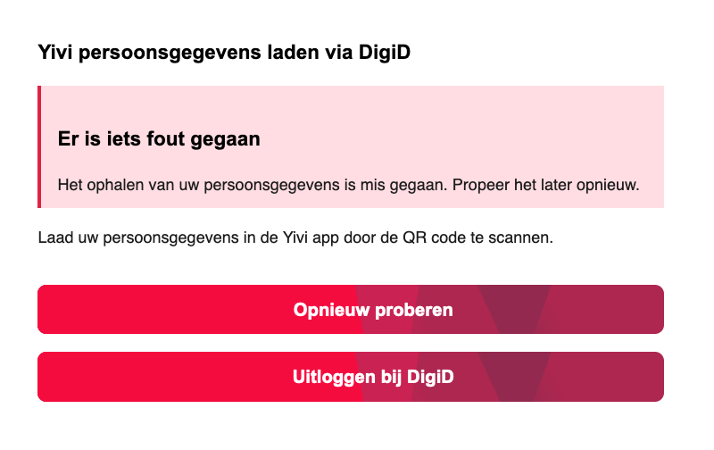
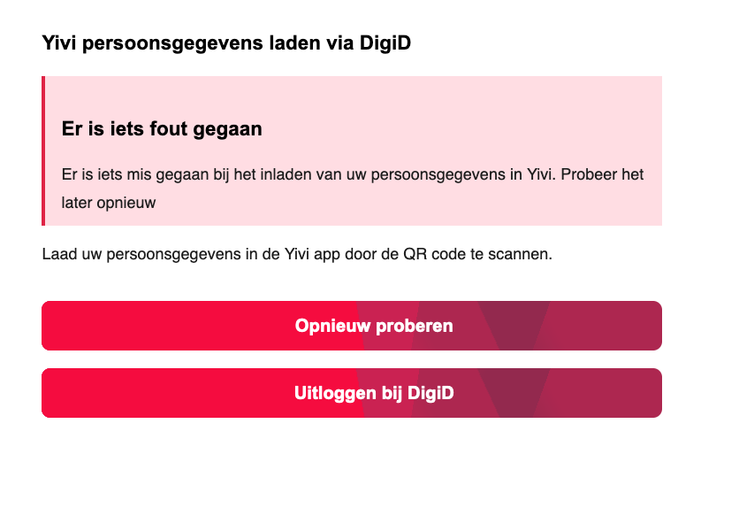

# Yivi issue app testen

Getest vanuit user interface:
- Happy flow (standaard BSN) inclusief uitloggen
- Cancel via de Yivi app (bug gefixt in Andoird/iOS app)
- Timeout van sessie Yivi (iets voor de webapp sessie verloopt)
- Timeout van sessie webapp (iets later dan Yivi)
- Overleden persoon (test BSN)
- DigiD LOA (elk niveau) inclusief te laag (basis)
- Invalide BSN
- Niet bestaand persoon

Technisch getest:
- BRP url vervangen door niet bestaande url
- Yivi server url vervangen door niet bestaande url
- Timeout BRP api (unit test) toegevoegd
- Timeout Yivi api (unit test) toegevoegd

## Resultaten 

- ✅ Happy flow (standaard BSN) inclusief uitloggen
  - Werkt zoals verwacht met verschillende test BSN's 
- ✅ Cancel via de Yivi app (bug gefixt in Andoird/iOS app)
  - Na app update werkt zoals verwacht 
  - ❗️ Styling van submit button nog niet oke (wachten op update yivi-frontend-packages)
- ✅ Timeout van sessie Yivi (iets voor de webapp sessie verloopt)
  - Melding in QR app + probeer opnieuw knop
- ✅ Timeout van sessie webapp (iets later dan Yivi)
  - Melding in QR app + probeer opnieuw knop + user is uitgelogd
- ✅ Overleden persoon (test BSN)
  - Logging `persoon lijkt overleden`
  - Standaard BRP error (zie hieronder)
- ✅ DigiD LOA (elk niveau) inclusief te laag (basis)
  - Gebruiker niet ingelogd
  - [Melding niet juiste niveau](./Insufficient-loa.png)
  - Logging `Insufficient OIDC claims`
- ✅ Invalide BSN
  - Logging in de trant van BSN te lang of voldoet niet aan elfproef.
  - Standaard BRP error (zie hieronder)
- ✅ Niet bestaand persoon
  - Logging `BRP API: Het ophalen van gegevens is misgegaan`
  - Standaard BRP error (zie hieronder)

Technisch getest:
- ✅ BRP url vervangen door niet bestaande url
  - Standaard BRP error (zie hieronder)
- ✅ Yivi server url vervangen door niet bestaande url
  - Standaard Yivi error (zie hieronder)
- ✅ Timeout BRP api (unit test) toegevoegd
  - Check logging axios timeout
  - Standaard BRP error
- ✅ Timeout Yivi api (unit test) toegevoegd
  - Check logging axios timeout
  - Standaard Yivi error

## Standaard BRP error
Wanneer er een fout met BRP voorkomt (persoon overleden, niet berijkbaar, te traag, persoon niet gevonden) krijgt een gebruiker dit te zien

## Standaard Yivi error
Wanneer er een fout is in de communicaite met de Yivi issue server (vanuit de lambda) krijgt een gebruiker dit te zien. 
De yivi QR code package is verantwoordelijk voor afhandeling browser/Yivi server

