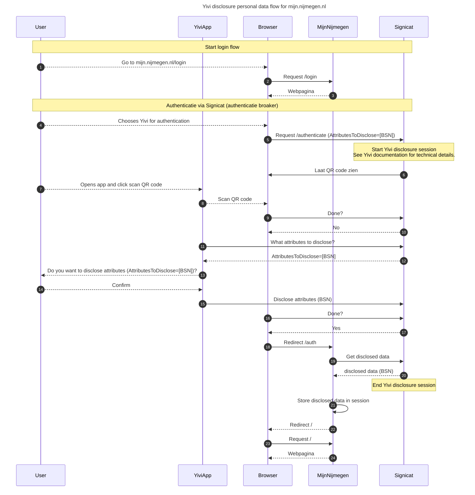

# Disclose flow mijn-nijmegen

Dit diagram beschrijft de flow van data bij disclosure tbv het inloggen bij mijn.nijmegen.nl. Dit beschrijft het deel waar Gemeente Nijmegen zelf invloed op heeft. Signicat maakt gebruik van een Yivi omgeving om de Yivi disclosure sessie te doen. Meer details over de disclosure sessie kan je vinden op https://irma.app/docs/irma-protocol/#sequence-diagram

