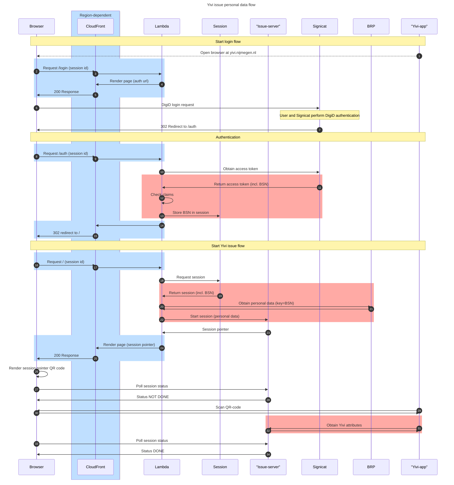

# Issue flow

Issuing of credentials can be described by the following diagram. We use CloudFront as the CDN for the web-facing part of the application. In the diagram:
- **blue**: Parts of the flow that are region-dependent. These are routed over the public internet to/from AWS edge locations (usually in Europe, can flow through the US).
- **red**: Parts of the flow that carry personal information. These are all hosted in/routed within the EU.

